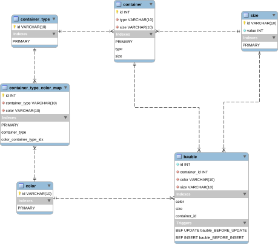

# Schema Design

## Introduction
This a simple readme file to explain the reasoning for the design structure, give justification for certain design preference (so that future development can use to understand if the justification still holds true and if it can be change) and certain details like trigger on the database to ensure data-consistency (acting like a fail-safe even if the service using it fails or tries to insert invalid data).

### Installation and Development
The setup starts off two container in docker where one container are:
1. Adminer which can be used for GUI operations on the MySQL instance of the database.
2. MySQL which is a test-db where username: `user` and password: `pass` can be used to login to the `test` database schema instance.
3. Also, remember to login with root and enable binary-logging or make a customer dockerfile of MySQL with the configuration to enable this. the below will force the global binary logging to true.
```sql
 set global log_bin_trust_function_creators = 1 
```

To install the two container simply run `dev-env.sh` file. And it will pull two images used for the development operations of the schema. The shell file expects the docker is properly installed on your local.

### Design and explaination of the schema
The first part of this a schema diagram for the database, and the second part is the explaination for the choices taken.

#### Diagram


#### Explaination

**Size Table**
	The Size table has a id which is the primary key and is of type string, this ensure that be can get the size of the given bauble or container without having to join tables for most select (get operations). *Example:* When you get all baubles or a single baubles the foreign key is a string which can be read or directly understood without having to dig into the size table to find out what that is (this would be the scenario for a number based foreign key) on the bauble and container table. The value column for the size table is used for comparing between the various size, the code can use this value to figure out which size is bigger with a numeric representation of it. This allows for the adding more size and ensure that the code still continue to work without too much modification to the underlaying schema.

**Color Table**
	The Color table has just an id which is the string presenetation of the color.

**Container Type**
	The container type is used to store different type of container, again this allows the option to insert new type beyond boxes and buckets. Again id is a string to easy identify the container name without having to deep-dive into another table to find out what the container is.

**Container type color map**
	The table basically store the associated colors to a given container, this allow us to add, remove new color based rules for the baubles without having modify the schema, and since the container_type and color are indexed this would allow the insert of bauble to be quick (enough - O(log2n) per insert) without breaking the contraints on the table.

**Container**
	The table stores the container, the type of the container, the size of the container which is used to figure out the type of baubles which can be associated with the container.

**Bauble**
	The table stores the baubles and the associated container for the bauble. This ensure that every bauble has a container associated with it. There is a cascading delete and update on the bauble table if the associated container is deleted. There are two trigger on `insert` and `update` operation this ensure that the baubles mutated on maintains data-consistency. The trigger check the size of the bauble with the size of the container, also the container-type and the colors allowed for that type of container.

```
Why triggers?

Well, this ensure that data-consistency is intact even if the above api logic is broken because of introducing a change (being safer than dealing with millions of records which are corrupted)
```
